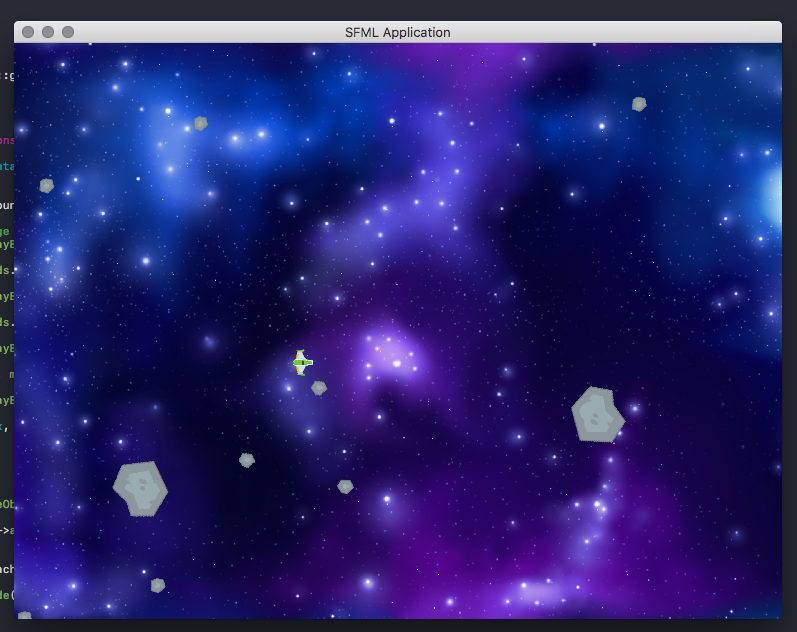

# asteroids_cpp
Very simple asteroids clone in C++

Based off of SFML Game Development by Moreira, Hansson, and Haller

Just to get some practice with modern C++, SFML, and maybe some OpenGL/Shader stuff. The game itself is secondary, and not meant to be any good at all.

# FAQ
###### Is this a game engine?

Definitly not!

###### This is terrible, why did you bother?

Because it is a good book, and this gives me an incentive to practice.

